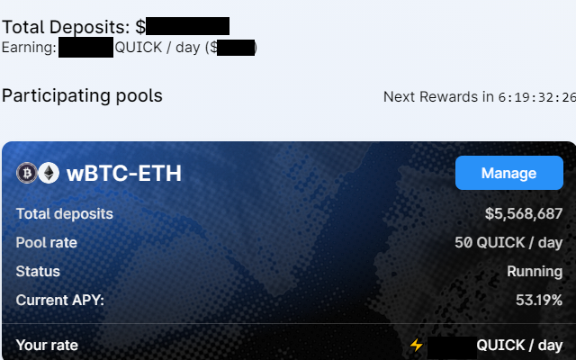

# Quickswap APY Calculator Chrome/Brave Extension

This is a browser extension that calculates the APYs on https://quickswap.exchange/#/quick

Avaiable on the Chrome Web Store at https://chrome.google.com/webstore/detail/quickswapapy/nifdpfodhfppdajlaemhhjijjpfjmpjb

Click the extension and the APYs will load

This is what the website will look like after the script has run

The extension now calculates your total deposits, total QUICK/day, and total USD per day among the pools you have deposited in. This feature only uses data displayed on the page so if you have deposited in more than 10 pools it will only work for the pools you have deposited in on the page you are currently on.

