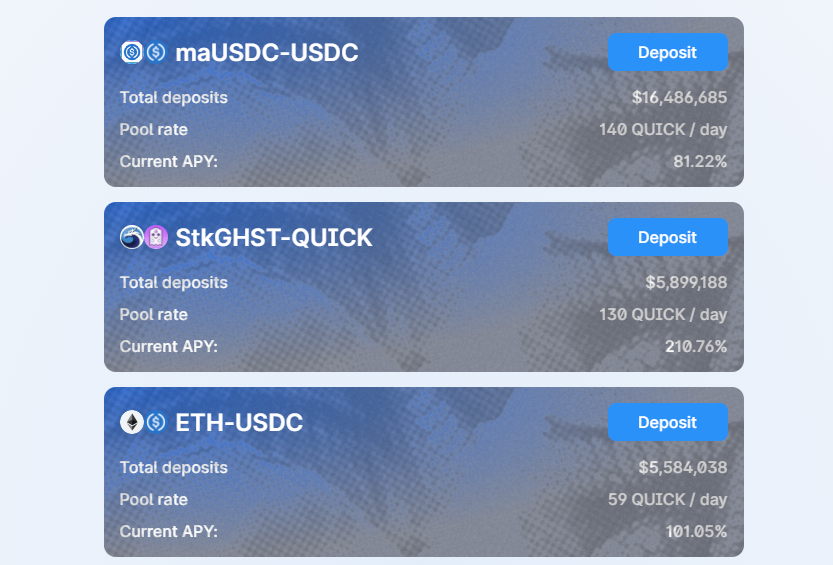

# Quickswap APY Calculator Chrome/Brave Extension

This is a browser extension that calculates the APYs on quickswap.exchange/#/quick

Click the extension and the APYs will load

There will be some display problems if you have anything deposited into any of the pools. In this case it is best to disconnect your wallet and change the variable 'disconnected', in the file "displayAPYs.js", from 0 to 1.

This is what the website will look like after the script has run

